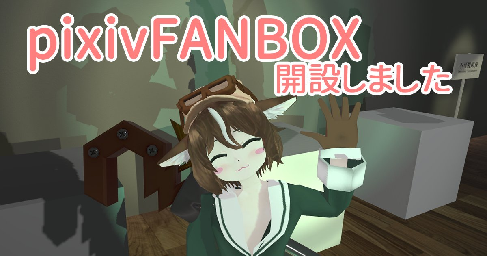

[TOC]

# ■ pixivFANBOX

pixivFANBOXにて、開発中のアプリやVRChat用アセット等を支援者向けに公開しています。  
[https://www.pixiv.net/fanbox/creator/5179544](https://www.pixiv.net/fanbox/creator/5179544)

# ■ VRCTools

## [VRCHaptics](https://tsubokulab.github.io/vrchaptics/)
触覚デバイスbHapticsをVRChatで使用するためのアプリ＆UnityAssetsのセット。  
pixivFANBOXにて公開中→[https://www.pixiv.net/fanbox/creator/5179544/post/371411](https://www.pixiv.net/fanbox/creator/5179544/post/371411)

<iframe width="832" height="468" src="https://www.youtube.com/embed/PCnYJPk400I" frameborder="0" allow="accelerometer; autoplay; encrypted-media; gyroscope; picture-in-picture" allowfullscreen></iframe>

## [YTLiveOSC](https://www.pixiv.net/fanbox/creator/5179544/post/222812)
VRChatワールドをYouTubeLiveコメント＆スーパーチャットに対応させるソフト＆サンプルPrefab/シーンのセット。  
pixivFANBOXにて公開中→[https://www.pixiv.net/fanbox/creator/5179544/post/222812](https://www.pixiv.net/fanbox/creator/5179544/post/222812)

<iframe width="832" height="468" src="https://www.youtube.com/embed/k_JCv8MDcFE" frameborder="0" allow="accelerometer; autoplay; encrypted-media; gyroscope; picture-in-picture" allowfullscreen></iframe>

## PhantomPlayer
YouTubeLiveコメントでマウスやキーボード操作を行うソフトウェア。VRChat等のアプリを視聴者のコメントで操作できるようになる。  
ソフトウェアはまだ未公開ですが、以下のYouTube生放送でテストを行いました。

<iframe width="832" height="468" src="https://www.youtube.com/embed/9RjUWkKC1iQ" frameborder="0" allow="accelerometer; autoplay; encrypted-media; gyroscope; picture-in-picture" allowfullscreen></iframe>

## VideoMixerSystem
VRChatワールドで使えるカメラ＆ビデオミキサーのセット。  
VRChat内の撮影スタジオ「[Virtual TV Studio 720p](https://vrchat.com/home/world/wrld_5779f827-6b4b-456b-a8c5-612074f8de8d)」及び「[Virtual TV Studio 1080p](https://vrchat.com/home/world/wrld_876856a1-1dc4-4a52-b540-6803a9a3c1e6)」内でご使用頂けます。

<iframe width="832" height="468" src="https://www.youtube.com/embed/JjjP75W3LtA" frameborder="0" allow="accelerometer; autoplay; encrypted-media; gyroscope; picture-in-picture" allowfullscreen></iframe>

## [ジョイントドアPrefabs](https://booth.pm/ja/items/1226460)
VRChatワールドに使えるジョイント式・スライド式ドアのモデルとギミックのセット。  
Boothにて販売中→[https://tsubokulab.booth.pm/items/1226460](https://tsubokulab.booth.pm/items/1226460)  
pixivFANBOX支援者の方は無料でダウンロード頂けます→[https://www.pixiv.net/fanbox/creator/5179544/post/286899](https://www.pixiv.net/fanbox/creator/5179544/post/286899)

<iframe width="832" height="468" src="https://www.youtube.com/embed/IRFRMmRPWio" frameborder="0" allow="accelerometer; autoplay; encrypted-media; gyroscope; picture-in-picture" allowfullscreen></iframe>

## [パーティクラッカーPrefab](https://tsubokulab.booth.pm/items/1226335)
VRChatワールドに使えるパーティクラッカーのモデルとギミックのセット。  
Boothにて販売中→[https://tsubokulab.booth.pm/items/1226335](https://tsubokulab.booth.pm/items/1226335)  
pixivFANBOX支援者の方は無料でダウンロード頂けます→[https://www.pixiv.net/fanbox/creator/5179544/post/286899](https://www.pixiv.net/fanbox/creator/5179544/post/286899)

<iframe width="832" height="468" src="https://www.youtube.com/embed/4oInh1l3cEI" frameborder="0" allow="accelerometer; autoplay; encrypted-media; gyroscope; picture-in-picture" allowfullscreen></iframe>

## [タライ.fbx](https://tsubokulab.booth.pm/items/1226150)

Boothにて販売中→[https://tsubokulab.booth.pm/items/1226150](https://tsubokulab.booth.pm/items/1226150)  
pixivFANBOX支援者の方は無料でダウンロード頂けます→[https://www.pixiv.net/fanbox/creator/5179544/post/286899](https://www.pixiv.net/fanbox/creator/5179544/post/286899)

<iframe width="832" height="468" src="https://www.youtube.com/embed/mbPJullIO6I" frameborder="0" allow="accelerometer; autoplay; encrypted-media; gyroscope; picture-in-picture" allowfullscreen></iframe>

## [ゴミ箱.fbx](https://tsubokulab.booth.pm/items/1226195)

Boothにて販売中→[https://tsubokulab.booth.pm/items/1226195](https://tsubokulab.booth.pm/items/1226195)  
pixivFANBOX支援者の方は無料でダウンロード頂けます→[https://www.pixiv.net/fanbox/creator/5179544/post/286899](https://www.pixiv.net/fanbox/creator/5179544/post/286899)

<iframe width="832" height="468" src="https://www.youtube.com/embed/bMeJj75L-2U" frameborder="0" allow="accelerometer; autoplay; encrypted-media; gyroscope; picture-in-picture" allowfullscreen></iframe>

## [デジタルノギスセイバー](https://tsubokulab.booth.pm/items/1226335)

Boothにて販売中→[https://tsubokulab.booth.pm/items/1226138](https://tsubokulab.booth.pm/items/1226138)  
pixivFANBOX支援者の方は無料でダウンロード頂けます→[https://www.pixiv.net/fanbox/creator/5179544/post/286899](https://www.pixiv.net/fanbox/creator/5179544/post/286899)

<iframe width="832" height="468" src="https://www.youtube.com/embed/mqtJnW9Jb_Y" frameborder="0" allow="accelerometer; autoplay; encrypted-media; gyroscope; picture-in-picture" allowfullscreen></iframe>

## [レンチロッド](https://tsubokulab.booth.pm/items/943415)

Boothにて販売中→[https://tsubokulab.booth.pm/items/943415](https://tsubokulab.booth.pm/items/943415)  
pixivFANBOX支援者の方は無料でダウンロード頂けます→[https://www.pixiv.net/fanbox/creator/5179544/post/286899](https://www.pixiv.net/fanbox/creator/5179544/post/286899)

<iframe width="832" height="468" src="https://www.youtube.com/embed/No3O8NtzUY8" frameborder="0" allow="accelerometer; autoplay; encrypted-media; gyroscope; picture-in-picture" allowfullscreen></iframe>

## [はんだごて.fbx](https://tsubokulab.booth.pm/items/1226043)

Boothにて無料配布中→[https://tsubokulab.booth.pm/items/1226043](https://tsubokulab.booth.pm/items/1226043)

<iframe width="832" height="468" src="https://www.youtube.com/embed/IcQatV6-CHI" frameborder="0" allow="accelerometer; autoplay; encrypted-media; gyroscope; picture-in-picture" allowfullscreen></iframe>

# ■ VRChat上の制作物など

## Danchi - 団地

<iframe width="832" height="468" src="https://www.youtube.com/embed/LFpJSJbxvSs" frameborder="0" allow="accelerometer; autoplay; encrypted-media; gyroscope; picture-in-picture" allowfullscreen></iframe>

## Japanese Office / 坪倉仮想事務所

<iframe width="832" height="468" src="https://www.youtube.com/embed/FH7H3WnRLkg" frameborder="0" allow="accelerometer; autoplay; encrypted-media; gyroscope; picture-in-picture" allowfullscreen></iframe>

## 坪倉家 | Tsubokura's Home

<iframe width="832" height="468" src="https://www.youtube.com/embed/ekUXvF0Miv0" frameborder="0" allow="accelerometer; autoplay; encrypted-media; gyroscope; picture-in-picture" allowfullscreen></iframe>

## 坪倉家-夜 | Tsubokura's Home-Night

<iframe width="832" height="468" src="https://www.youtube.com/embed/Gz6y0cxHz_0" frameborder="0" allow="accelerometer; autoplay; encrypted-media; gyroscope; picture-in-picture" allowfullscreen></iframe>

## Virtual TV Studio 720p/1080p

<iframe width="832" height="468" src="https://www.youtube.com/embed/JjjP75W3LtA" frameborder="0" allow="accelerometer; autoplay; encrypted-media; gyroscope; picture-in-picture" allowfullscreen></iframe>

