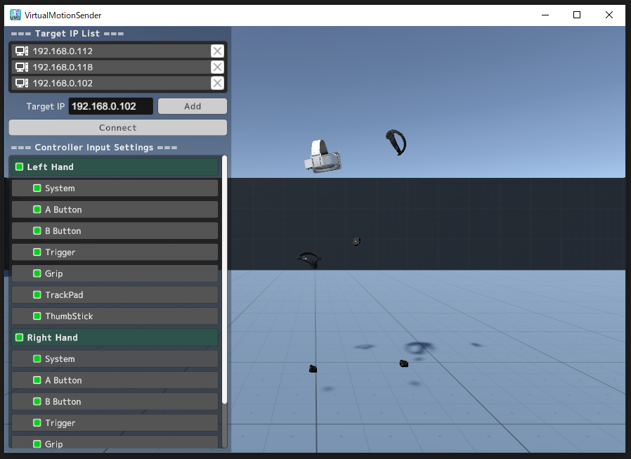

# ■ pixivFANBOX

pixivFANBOXにて、開発中のアプリやVRChat用アセット等を支援者向けに公開しています。  
[https://www.pixiv.net/fanbox/creator/5179544](https://www.pixiv.net/fanbox/creator/5179544)

# ■ BOOTHで販売中のアセット

## [スライドショーシステム / SlideshowSystem](https://tsubokulab.booth.pm/items/3755033)

<iframe width="832" height="468" src="https://www.youtube.com/embed/zqtGkY6F0TQ" frameborder="0" allow="accelerometer; autoplay; encrypted-media; gyroscope; picture-in-picture" allowfullscreen></iframe>

## [ワールドメガホン / WorldMegaphone](https://tsubokulab.booth.pm/items/3755026)

<iframe width="832" height="468" src="https://www.youtube.com/embed/rL_T5agBevw" frameborder="0" allow="accelerometer; autoplay; encrypted-media; gyroscope; picture-in-picture" allowfullscreen></iframe>

## [【VRChat】ワールド音響調整アセット / AudioReverbFilterSettings【UdonProps】](https://tsubokulab.booth.pm/items/4941668)

## [ふんわりホバーボード / Hoverboard](https://tsubokulab.booth.pm/items/3749085)

<iframe width="832" height="468" src="https://www.youtube.com/embed/7a-fmy5sGIE" frameborder="0" allow="accelerometer; autoplay; encrypted-media; gyroscope; picture-in-picture" allowfullscreen></iframe>

## [日本の道路パック](https://tsubokulab.booth.pm/items/2442389)

<iframe width="832" height="468" src="https://www.youtube.com/embed/ex-KE_2OyXo" frameborder="0" allow="accelerometer; autoplay; encrypted-media; gyroscope; picture-in-picture" allowfullscreen></iframe>

## 小物3Dモデル

## [ジョイントドアPrefabs](https://booth.pm/ja/items/1226460)

VRChatワールドに使えるジョイント式・スライド式ドアのモデルとギミックのセット。  
Boothにて販売中→[https://tsubokulab.booth.pm/items/1226460](https://tsubokulab.booth.pm/items/1226460)  
pixivFANBOX支援者の方は無料でダウンロード頂けます→[https://www.pixiv.net/fanbox/creator/5179544/post/286899](https://www.pixiv.net/fanbox/creator/5179544/post/286899)

<iframe width="832" height="468" src="https://www.youtube.com/embed/IRFRMmRPWio" frameborder="0" allow="accelerometer; autoplay; encrypted-media; gyroscope; picture-in-picture" allowfullscreen></iframe>

## [パーティクラッカーPrefab](https://tsubokulab.booth.pm/items/1226335)

VRChatワールドに使えるパーティクラッカーのモデルとギミックのセット。  
Boothにて販売中→[https://tsubokulab.booth.pm/items/1226335](https://tsubokulab.booth.pm/items/1226335)  
pixivFANBOX支援者の方は無料でダウンロード頂けます→[https://www.pixiv.net/fanbox/creator/5179544/post/286899](https://www.pixiv.net/fanbox/creator/5179544/post/286899)

<iframe width="832" height="468" src="https://www.youtube.com/embed/4oInh1l3cEI" frameborder="0" allow="accelerometer; autoplay; encrypted-media; gyroscope; picture-in-picture" allowfullscreen></iframe>

* [VRChatイベントカレンダーPrefab【毎日自動更新】](https://tsubokulab.booth.pm/items/1223535)  
  

* [タライ.fbx](https://tsubokulab.booth.pm/items/1226150)

* [ゴミ箱.fbx](https://tsubokulab.booth.pm/items/1226195)

* [デジタルノギスセイバー](https://tsubokulab.booth.pm/items/1226335)

* [レンチロッド](https://tsubokulab.booth.pm/items/943415)  
  

* [はんだごて.fbx](https://tsubokulab.booth.pm/items/1226043)

# ■ FANBOXで公開中のアセット

## [Virtual Motion Sender](https://tsubokulab.github.io/virtualmotionsender/)

 

SteamVRのトラッカー・コントローラーの位置や入力を別PCに複製転送するアプリ  
pixivFANBOXにて公開中→ [https://tsubokulab.fanbox.cc/posts/9372391](https://tsubokulab.fanbox.cc/posts/9372391)

## [VRCHaptics](https://tsubokulab.github.io/vrchaptics/)

触覚デバイスbHapticsをVRChatで使用するためのアプリ＆UnityAssetsのセット。  
pixivFANBOXにて公開中→[https://www.pixiv.net/fanbox/creator/5179544/post/371411](https://www.pixiv.net/fanbox/creator/5179544/post/371411)

<iframe width="832" height="468" src="https://www.youtube.com/embed/PCnYJPk400I" frameborder="0" allow="accelerometer; autoplay; encrypted-media; gyroscope; picture-in-picture" allowfullscreen></iframe>

## [YTLiveOSC](https://www.pixiv.net/fanbox/creator/5179544/post/222812)
VRChatワールドをYouTubeLiveコメント＆スーパーチャットに対応させるソフト＆サンプルPrefab/シーンのセット。  
pixivFANBOXにて公開中→[https://www.pixiv.net/fanbox/creator/5179544/post/222812](https://www.pixiv.net/fanbox/creator/5179544/post/222812)

<iframe width="832" height="468" src="https://www.youtube.com/embed/k_JCv8MDcFE" frameborder="0" allow="accelerometer; autoplay; encrypted-media; gyroscope; picture-in-picture" allowfullscreen></iframe>

## PhantomPlayer【未公開】
YouTubeLiveコメントでマウスやキーボード操作を行うソフトウェア。VRChat等のアプリを視聴者のコメントで操作できるようになる。  
ソフトウェアはまだ未公開ですが、以下のYouTube生放送でテストを行いました。

<iframe width="832" height="468" src="https://www.youtube.com/embed/9RjUWkKC1iQ" frameborder="0" allow="accelerometer; autoplay; encrypted-media; gyroscope; picture-in-picture" allowfullscreen></iframe>

# ■ VRChat上の制作物など

## [キティちゃんのポップコーンマシーンVRミニゲーム](https://youtube.com/shorts/T44u_ME-5BM?si=mYmGzs7B0Vovhwwr)  

> 公開期間：2024年2月19日～3月17日  
> クライアント：株式会社サンリオ

<iframe width="468" height="832" src="https://www.youtube.com/embed/T44u_ME-5BM?si=eyb7-AGmBWWW8Hqc" frameborder="0" allow="accelerometer; autoplay; encrypted-media; gyroscope; picture-in-picture" allowfullscreen></iframe>

## [ポチャッコのぱくぱく大作戦 -Share the ice cream love-](https://v-fes.sanrio.co.jp/floors#pochacco)  

> 開催期間：2024年2月19日～3月25日  
> クライアント：株式会社サンリオ

<iframe width="832" height="468" src="https://www.youtube.com/embed/H_wzNtaDqBg" frameborder="0" allow="accelerometer; autoplay; encrypted-media; gyroscope; picture-in-picture" allowfullscreen></iframe>

## [Virtual Fashion Collection ”Voyage”](https://www.youtube.com/watch?v=dQUpnPTsX_8&t=3266s)  

> Virtual Fashion Collection ”Voyage” 2023 Winter  
> 開催日：2023年12月23日  
> クライアント：株式会社RiRi　協賛：株式会社ビームス、株式会社ポリゴンテーラー、株式会社往来

<iframe width="832" height="468" src="https://www.youtube.com/embed/dQUpnPTsX_8?si=Ny8XJZBtywgistnl&amp;start=2171" title="YouTube video player" frameborder="0" allow="accelerometer; autoplay; encrypted-media; gyroscope; picture-in-picture" allowfullscreen></iframe>

> Virtual Fashion Collection ”Voyage” 2023 Spring/Summer  
> 開催日：2023年5月27日  
> クライアント：株式会社RiRi　協賛：株式会社往来

<iframe width="832" height="468" src="https://www.youtube.com/embed/-Dn2hKsBpv4?si=l3z7MENjLZDKkQdI&amp;start=1168" title="YouTube video player" frameborder="0" allow="accelerometer; autoplay; encrypted-media; gyroscope; picture-in-picture" allowfullscreen></iframe>

## [VERTEX˸ VRCBattleRoyale](https://vrchat.com/home/world/wrld_3c3ccab6-8a26-44ef-979f-af8037ebd7a2)

<iframe width="832" height="468" src="https://www.youtube.com/embed/0BXC4zWWILQ" frameborder="0" allow="accelerometer; autoplay; encrypted-media; gyroscope; picture-in-picture" allowfullscreen></iframe>

## [Danchi - 団地](https://vrchat.com/home/world/wrld_73a81298-ee2a-4f78-8d0a-ca1a13cea624)

<iframe width="832" height="468" src="https://www.youtube.com/embed/LFpJSJbxvSs" frameborder="0" allow="accelerometer; autoplay; encrypted-media; gyroscope; picture-in-picture" allowfullscreen></iframe>

## [坪倉仮想美術館 - Tsubokura Virtual Museum](https://api.vrchat.cloud/api/1/file/file_2403ceac-3aec-46d3-9e82-9079949cfd29/2/file)

## [Japanese Office / 坪倉仮想事務所](https://vrchat.com/home/world/wrld_5ca27077-273a-4e27-818c-a13cd2bceb90)

<iframe width="832" height="468" src="https://www.youtube.com/embed/FH7H3WnRLkg" frameborder="0" allow="accelerometer; autoplay; encrypted-media; gyroscope; picture-in-picture" allowfullscreen></iframe>

## [坪倉家 | Tsubokura's Home](https://vrchat.com/home/world/wrld_28e96571-5447-4ce4-9b01-0a812da7426b)

<iframe width="832" height="468" src="https://www.youtube.com/embed/ekUXvF0Miv0" frameborder="0" allow="accelerometer; autoplay; encrypted-media; gyroscope; picture-in-picture" allowfullscreen></iframe>

## [坪倉家-夜 | Tsubokura's Home-Night](https://vrchat.com/home/world/wrld_a5f01c1e-a54d-4156-af67-ba71bf803e06)

<iframe width="832" height="468" src="https://www.youtube.com/embed/Gz6y0cxHz_0" frameborder="0" allow="accelerometer; autoplay; encrypted-media; gyroscope; picture-in-picture" allowfullscreen></iframe>

## [Virtual TV Studio 720p/1080p](https://vrchat.com/home/world/wrld_876856a1-1dc4-4a52-b540-6803a9a3c1e6)

VRChatワールドで使えるカメラ＆ビデオミキサーのセット。  
VRChat内の撮影スタジオ「[Virtual TV Studio 720p](https://vrchat.com/home/world/wrld_5779f827-6b4b-456b-a8c5-612074f8de8d)」及び「[Virtual TV Studio 1080p](https://vrchat.com/home/world/wrld_876856a1-1dc4-4a52-b540-6803a9a3c1e6)」内でご使用頂けます。

<iframe width="832" height="468" src="https://www.youtube.com/embed/JjjP75W3LtA" frameborder="0" allow="accelerometer; autoplay; encrypted-media; gyroscope; picture-in-picture" allowfullscreen></iframe>

# その他

## [setSoundDeviceByName](https://github.com/TsubokuLab/setSoundDeviceByName)

タスクバーのアイコンをワンクリックでWindowsの音声出力先を変更できるツール。
ショートカットキーも設定できるので、スピーカーとヘッドセットを行き来する方などに便利です。

