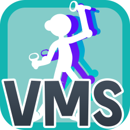
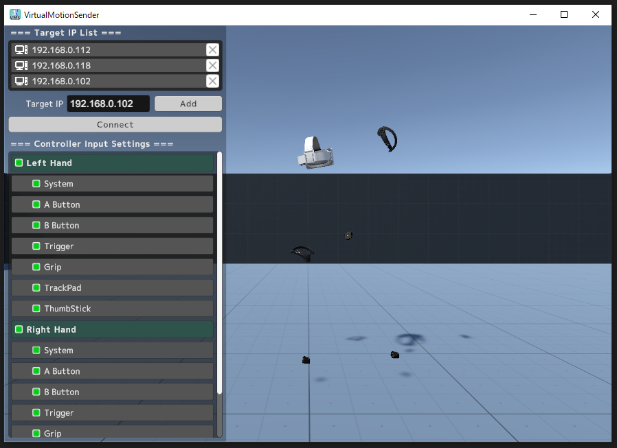
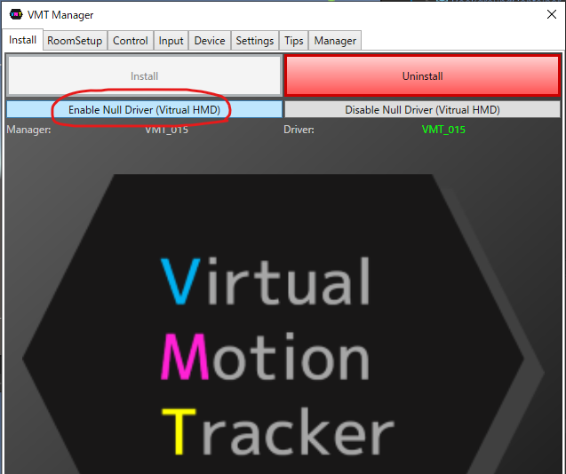
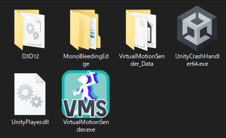
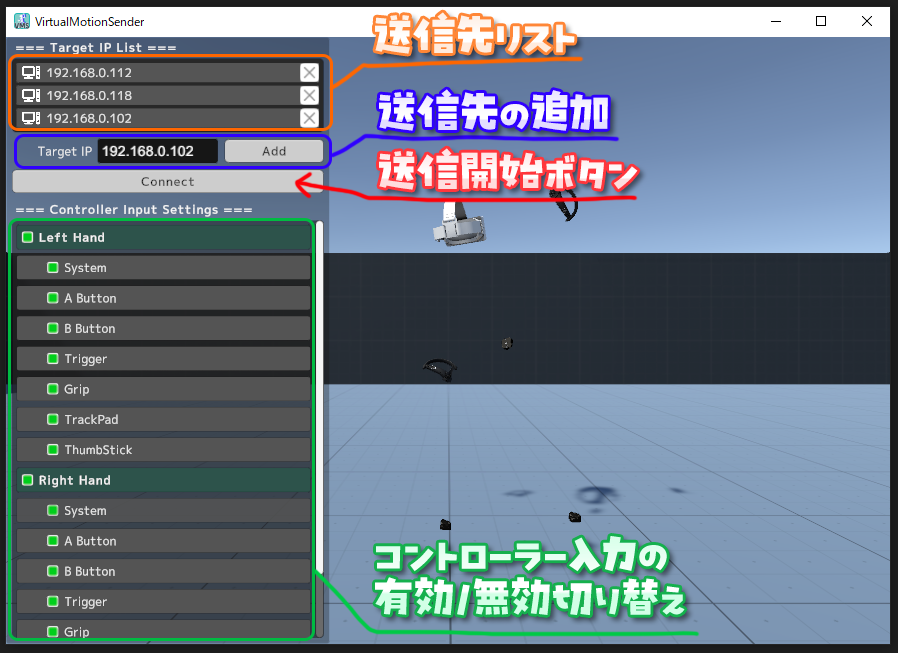

---

layout: default  
title: Virtual Motion Sender  
tagline: SteamVRのトラッカー位置やコントローラー入力を複数PCに転送するアプリ</br><a href="http://translate.google.com/translate?hl=ja&sl=auto&tl=en&u=http%3A%2F%2Fgithub.teruaki-tsubokura.com%2Fvirtualmotionsender%2F" style="color:white;text-decoration:underline;">English(Google Translate)</a>
description: "SteamVRのトラッカー位置やコントローラー入力を複数PCに転送するアプリ"
image: http://github.teruaki-tsubokura.com/virtualmotionsender/images/thumbnail.png
---






-----

[TOC]

-----

## 概要

SteamVRのトラッカー位置やコントローラー入力を複数PCに転送するアプリ


**Download：（準備中）**  
※VirtualMotionSenderは現在FANBOX支援者限定でβ公開中です。

**Updates：[更新履歴](https://github.teruaki-tsubokura.com/virtualmotionsender/changelog)**  
2025/02/06 --- v0.0.1 公開


## 仕組み


1. SteamVRのオーバーレイアプリでトラッカー位置やコントローラー入力を取得し、同じローカルネット内の複数のPCにOSC信号で送信する。
1. 受信側ではOSC信号を受信し「Virtual Motion Tracker」の機能を利用して仮想コントローラーとしてトラッカーの位置やコントローラー入力を再現する。


## 使い方

**`送信側PC`**と**`受信側PC`**の両方のパソコンに[SteamVR](https://store.steampowered.com/app/250820/SteamVR/)がインストールされている前提で話を進めます。

#### ■ 受信側PC（遠隔操作される側）

1. Virtual Motion Trackerのインストールと初期設定  
   https://gpsnmeajp.github.io/VirtualMotionTrackerDocument/setup/
   
2. 更に**Enable Null Driver (Virtual HMD)** をクリックして仮想HMDを有効化  
   
   
3. SteamVRを起動して待機させておく

#### ■ 送信側PC（VR操作する側）

1. VirtualMotionSenderアプリをダウンロードしてZipファイルを展開する

2. **VirtualMotionSender.exe**を起動  
   

3. ファイアウォールのセキュリティ警告ウィンドウが出るので、「プライベートネットワーク」にチェックを入れて「アクセスを許可する」ボタンを押す。
   ※パブリックネットワークで使用する場合は両方のチェックを入れて下さい。
   

4. 送信先リストに送信先PCを追加する  
   

   1. Target IPのテキスト入力欄に送信先IPアドレスを入力して「Add」ボタンを押すと追加できる。

   2. 送信先リストからアドレスを削除したい場合は、IPアドレスの右の「✕」印をクリックする。

      ```
      送信先PCのIPアドレスの調べるには、スタート＞Windowsシステムツール＞コマンドプロンプト を開き、ipconfigと入力すると「192.168.xxx.xxx」のような形で表示されます。
      ```

5. 「Connect」ボタンを押す

   * 全ての送信先に対し、SteamVRのトラッキングデバイスの位置や角度情報と左右のコントローラーデバイスの入力信号が送信開始されます。（現在動作確認済みなのはValve Indexコントローラーのみ）
   * 再度押すことで送信を停止します。

## 推奨動作環境
* Windows10
* GPU: Nvidia GeForce GTX1060 以上
* CPU: Intel Core i5 以上


## 利用規約

* 個人利用に限り商用利用可能（法人利用はお問い合わせ下さい）
* VTuberの配信やロケーションベースVRアトラクション、研究開発等ご自由にお使い下さい。
* アプリ本体の再配布は不可
* 迷惑行為や宗教・政治活動への利用は不可
* 本データの利用によって生じた損害等の一切の責任を負いかねます


## クレジット

当アプリの受信側PCの仮想トラッカードライバーには、[gpsnmeajp](https://github.com/gpsnmeajp)様の **Virtual Motion Tracker** を使用させて頂いています。

* Virtual Motion Tracker (MITライセンス)  
  [https://gpsnmeajp.github.io/VirtualMotionTrackerDocument/](https://gpsnmeajp.github.io/VirtualMotionTrackerDocument/)

OSC送信機能には、[hecomi](https://github.com/hecomi)様の **uOSC** を使用させて頂いています。

* uOSC (MITライセンス)  
  [https://github.com/hecomi/uOSC](https://github.com/hecomi/uOSC)
