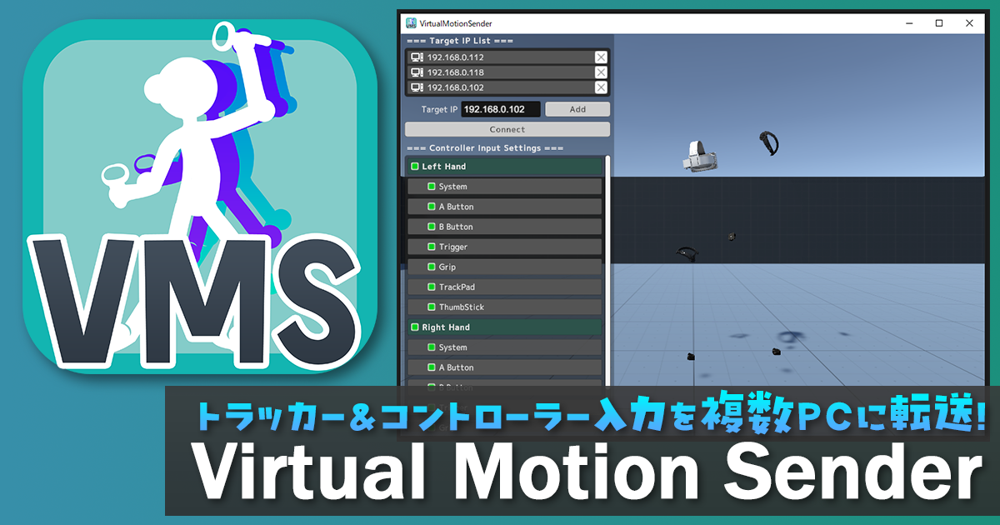

<a href ="images/VirtualMotionSender_thumbnail.png">

- Table of Content
{:toc}

-----

## 概要
SteamVRのトラッカー位置やコントローラー入力を複数PCに転送するアプリ。  
性質上、配信活動をするVTuberさんやパフォーマーさん向けですが、VRChat等での日常使い等、アイディア次第でいろんな用途に使えます。

#### 使用例

<a href ="images/VirtualMotionSender_System.png"></a>

* VRChatにVRで入りながら、別のVRゲームをプレイしている様子を配信する。
* VRChatイベント等で複数インスタンスに同時に存在しながらのダンス等パフォーマンスを行う。
* VTuber用アプリ等のSteamVRを使ったシステムで、負荷分散の為にトラッキング用PCと描画用PCを分ける。

などなど…

#### 仕組み

<a href ="images/VirtualMotionSender_System.png"></a>

1. SteamVRのオーバーレイアプリでトラッカー位置やコントローラー入力を取得し、同じローカルネット内の複数のPCにOSC信号で送信する。**（ポート番号：39570）**
2. 受信側ではOSC信号を受信し「[Virtual Motion Tracker](https://gpsnmeajp.github.io/VirtualMotionTrackerDocument/)」の機能を利用して仮想コントローラーとしてトラッカーの位置やコントローラー入力を再現する。


## ダウンロード
[https://tsubokulab.fanbox.cc/posts/9372391](https://tsubokulab.fanbox.cc/posts/9372391)  
※現在、FANBOX支援者限定でβ公開中です。


#### 動作確認済み機器

* Valve Index（開発に使用した機器）
  * [Index HMD](https://plaza.komodo.jp/collections/valve-index)
  * [Indexコントローラー](https://plaza.komodo.jp/collections/valve-index)
* HTC VIVE Pro
  * [VIVE Pro HMD](https://www.vive.com/jp/)
  * [VIVE Pro コントローラー(2018)](https://www.vive.com/jp/)
  * [VIVEトラッカー(3.0)](https://www.vive.com/jp/)

* Meta Quest3
  * [Quest3 HMD (SteamLink)](https://a.r10.to/hFNgio)
  * [Quest3コントローラー (SteamLink)](https://a.r10.to/hFNgio)

* Tundra Labs
  * [Tundraトラッカー](https://market.intofree.world/products/tundra-tracker-bundle)

```※Indexコントローラー以外のコントローラーでは、ボタンやトラックパッドの有無に合わせて入力バインドを調整して頂く必要がある場合があります。```

## 使い方

**`送信側PC`**と**`受信側PC`**の両方のパソコンに[SteamVR](https://store.steampowered.com/app/250820/SteamVR/)がインストールされている前提で話を進めます。

#### ■ 受信側PC（遠隔操作される側）

1. Virtual Motion Trackerのインストールと初期設定  
   [https://gpsnmeajp.github.io/VirtualMotionTrackerDocument/setup/](https://gpsnmeajp.github.io/VirtualMotionTrackerDocument/setup/)
   
2. 更に**Enable Null Driver (Virtual HMD)** をクリックして仮想HMDを有効化  
   
   
3. SteamVRを起動して待機させておく

#### ■ 送信側PC（VR操作する側）

1. VirtualMotionSenderアプリをダウンロードしてZipファイルを展開する

2. **VirtualMotionSender.exe**を起動  
   

3. 初回起動時のみファイアウォールのセキュリティ警告ウィンドウが出るので、「プライベートネットワーク」にチェックを入れて「アクセスを許可する」ボタンを押す。
   ※パブリックネットワークで使用する場合は両方のチェックを入れて下さい。
   

4. 送信先リストに送信先PCを追加する  
   

   1. Target IPのテキスト入力欄に送信先IPアドレスを入力して「Add」ボタンを押すと追加できる。

   2. 送信先リストからアドレスを削除したい場合は、IPアドレスの右の「✕」印をクリックする。

      * IPアドレスの調べ方  
      ```送信先PCのIPアドレスの調べるには、スタート＞Windowsシステムツール＞コマンドプロンプト を開き、ipconfigと入力すると「192.168.xxx.xxx」のような形で表示されます。```
      

   
   
5. 「Connect」ボタンを押す

   * 全ての送信先に対し、SteamVRのトラッキングデバイスの位置や角度情報と左右のコントローラーデバイスの入力信号が送信開始されます。受信側PCで正しくHMD＆コントローラー＆トラッカーの入力が認識されているかご確認下さい。
   * 再度押すことで送信を停止します。


ボタンやスティック・トラックパッドの入力は `[Controller Input Settings]` のトグルボタンをOFFにすることで入力を送信しないようにできます。  
**システムボタン(System)**に関しては、触れたかどうか（Touch）は送信できますが、押下（Click）は送信できませんでした（SteamVRかVirtual Motion Trackerの仕様？）  
**リモートPC側でSteamVRのダッシュボードを開く操作はできない**のでご注意下さい。


## 利用規約

* 個人利用に限り商用利用可能（法人利用はお問い合わせ下さい）
* VTuberの配信やロケーションベースVRアトラクション、研究開発等ご自由にお使い下さい。
* アプリ本体の再配布は不可
* 迷惑行為や宗教・政治活動への利用は不可
* 本データの利用によって生じた損害等の一切の責任を負いかねます


## クレジット

当アプリの受信側PCの仮想トラッカードライバーには、[gpsnmeajp](https://github.com/gpsnmeajp)様の **Virtual Motion Tracker** を使用させて頂いています。

* Virtual Motion Tracker (MITライセンス)  
  [https://gpsnmeajp.github.io/VirtualMotionTrackerDocument/](https://gpsnmeajp.github.io/VirtualMotionTrackerDocument/)

OSC送信機能には、[hecomi](https://github.com/hecomi)様の **uOSC** を使用させて頂いています。

* uOSC (MITライセンス)  
  [https://github.com/hecomi/uOSC](https://github.com/hecomi/uOSC)
