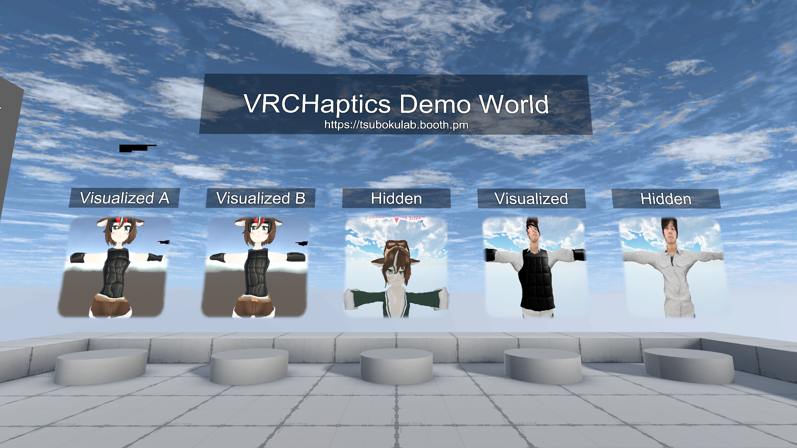

---

layout: default  
title: VRCHaptics  
tagline: 触覚スーツ「bHaptics」をVRChatで動作させるアプリ</br><a href="http://translate.google.com/translate?hl=ja&sl=auto&tl=en&u=http%3A%2F%2Fgithub.teruaki-tsubokura.com%2Fvrchaptics%2F" style="color:white;text-decoration:underline;">English(Google Translate)</a>

---

<div class="iframe-responsive"><iframe width="832" height="468" src="https://www.youtube.com/embed/PCnYJPk400I" frameborder="0" allow="accelerometer; autoplay; encrypted-media; gyroscope; picture-in-picture" allowfullscreen class="iframe"></iframe></div>

-----


* [概要](#概要)
* [仕組み](#仕組み)
* [内容物](#内容物)
* [使い方](#使い方)
  * [1. デバイスの接続](#1-デバイスの接続)
  * [2. アプリの起動](#2-アプリの起動)
  * [3. キャプチャアプリケーションを選択](#3-キャプチャアプリケーションを選択)
  * [4. 設定するデバイスの選択](#4-設定するデバイスの選択)
  * [5. デバイスの振動を有効にする](#5-デバイスの振動を有効にする)
  * [6. 振動強度を変更](#6-振動強度を変更)
  * [7. アプリのClip位置を調節する](#7-アプリのClip位置を調節する)
  * [8. アプリケーションを終了する](#8-アプリケーションを終了する)
* [VRCHaptics対応アバターセットアップ手順](#vrchaptics対応アバターセットアップ手順)
  * [1. 通常通りVRChatアバターを用意する](#1-通常通りvrchatアバターを用意する)
  * [2. VRCHaptics-VRChat.unitypackageをインポートする](#2-vrchaptics-vrchatunitypackageをインポートする)
  * [3. 触覚スーツ用Prefabをアバターに合わせて配置していく](#3-触覚スーツ用prefabをアバターに合わせて配置していく)
  * [4. VRCHapticsHelperを使ってアバターをセットアップする](#4-vrchapticshelperを使ってアバターをセットアップする)
  * [5. アバターをVRChatにアップロードし、動作確認する](#5-アバターをvrchatにアップロードし動作確認する)
* [デモワールド](#デモワールド)
* [推奨動作環境](#推奨動作環境)
* [【重要】使用前の注意事項](#重要使用前の注意事項)
* [利用規約](#利用規約)
* [クレジット](#クレジット)

-----

## 概要

**VRCHaptics ソフトウェア配布場所：[https://tsubokulab.fanbox.cc/posts/1205829](https://tsubokulab.fanbox.cc/posts/1205829)**
※VRCHapticsは現在クローズドテスト中です。pixivFANBOX 500円以上の支援者へ限定公開しています。

bHaptics社の販売する触覚スーツ([https://www.bhaptics.com/](https://www.bhaptics.com/))をVRChat等のソフトと連動して動作させるためのソフトウェアです。  
VRChatアバターに設定するための各種PrefabとUnityエディター拡張スクリプト等の専用アセット(UnityPackage)と共に使用します。

※使用するにはVRChatSDK及びUnityを使ったVRChatのアバターアップロードについての知識が必要です。
※正しく動作させるにはいくつか条件があります。[使用前の注意事項](#重要使用前の注意事項)をよくお読み下さい。

  

[https://www.bhaptics.com/tactsuit/](https://www.bhaptics.com/tactsuit/)  

デバイス対応状況

| デバイス名称      | 略称                | 説明           | 対応／未対応 |
| ----------------- | ------------------- | -------------- | ------------ |
| Tactot            | Vest                | 胴体           | 対応         |
| Tactosy for Arms  | ForearmL / ForearmR | 両腕           | 対応         |
| Tactal            | Head                | 頭             | 対応         |
| Tactosy for Hands | HandL / HandR       | グローブ(両手) | 対応         |
| Tactosy for Feet  | FootL / FootR       | 両足           | 対応         |


## 仕組み


1. 触覚ベストやアームデバイスに接近したオブジェクトをVRChat上のアバターカメラで撮影し、RenderTextureを画面上の固定位置に表示
2. そのRenderTextureをVRCHapticsアプリで画面キャプチャー
3. 色情報→振動に変換してbHapticsデバイスを制御

## 内容物

- VRCHaptics.exe --- アプリ本体
- VRCHaptics_settings.xml --- VRCHapicsの設定ファイル
- VRCHapticsAssets.unitypackage --- VRChat用アセットUnityPackage

## 使い方

### 1. デバイスの接続

1. **bHaptics公式サイト**から**[bHaptics Player](https://www.bhaptics.com/download)**アプリをインストールし起動

2. **歯車マーク**をクリックして設定画面を表示する  
   

3. デバイスの電源ボタンを押していき、**Scanned Devices**に表示されたら**Pair**ボタンを押下してペアリングを完了させる。  
   

4. ペアリングが完了するとデバイスのアイコンに色が着く  
   

5. もし腕デバイス(Tactosy)が2台とも右手に設定されたりした場合は、下部の**Device Position**で変更する。  
   

これでデバイスの準備は完了です。  

### 2. アプリの起動

1. **VRCHaptics.exe**を起動  
   

   

### 3. キャプチャアプリケーションを選択

起動後、場合によってはキャプチャするアプリケーションにVRChatが選択されていない事があります。
その場合は以下の手順でVRChatを選択して下さい。

1. 上部のマウスカーソルを合わせると「Change Application」と表示される赤枠の部分でマウスを左クリック  
   

2. 起動中のアプリケーション一覧が表示されるので、一覧から起動中のVRChatを選択する。  
   

### 4. 設定するデバイスの選択

1. Device Typeの右のプルダウンメニューから設定したいデバイスを選択  
   

### 5. デバイスの振動を有効にする

1. EnableチェックをクリックしてONにする  
   
2. Status表記がRunningになれば動作状態  
   

### 6. 振動強度を変更

1. Powerスライダーをドラッグして数値を変更する  
   

### 7. アプリのClip位置を調節する

1. Clip PositionのX,Y,W,Hスライダーをドラッグして数値を調整する。  
   ※基本的にはデフォルトのままでOK

   | パラメーター | 説明                                   |
   | ------------ | -------------------------------------- |
   | X            | 切り出し位置のX座標。画面の一番左が0。 |
   | Y            | 切り出し位置のY座標。画面の一番上が0。 |
   | W            | 切り出しサイズの横幅pixel数。          |
   | H            | 切り出しサイズの縦幅pixel数。          |

   なお、右のテキストボックスの数値を直接入力しても変更可能。  
左上の赤黒ドットのレイアウトは以下のようになっています。  
   
      
   
2. デフォルトの状態に戻すにはDefaultボタンを押下して下さい。  
   

### 8. アプリケーションを終了する

1. 右上の✕ボタンを押してアプリケーションを閉じる。  
   設定したパラメーターは保存され次回起動時に自動で読み込まれます。

## VRCHaptics対応アバターセットアップ手順

<div class="iframe-responsive"><iframe width="832" height="468" src="https://www.youtube.com/embed/koXWyfhBztU" frameborder="0" allow="accelerometer; autoplay; encrypted-media; gyroscope; picture-in-picture" allowfullscreen class="iframe"></iframe></div>

### 1. 通常通りVRChatアバターを用意する

### 2. VRCHapticsAssets.unitypackageをインポートする


### 3. VRCHapticsHelperを使用して触覚デバイス用Prefabを追加  
PrefabにはHidden(可視化モデル無し)とVisualized(可視化モデル有り)の2パターンがあります。  
Hidden(可視化モデル無し)の方が触覚スーツの動作は安定しますが、他人から動作状況が見えないので他人にフィードバックを返したい場合にVisuallized(可視化モデル有り)を利用して下さい。

| 部位         | モデル | 名称                                   |
| ------------ | ------ | -------------------------------------- |
| ベスト(胴体) | 非表示 | VRCHaptics_Vest_hidden.prefab          |
| 左腕         | 非表示 | VRCHaptics_LeftArm_hidden.prefab       |
| 右腕         | 非表示 | VRCHaptics_RightArm_hidden.prefab      |
| ゴーグル(頭) | 非表示 | VRCHaptics_Head_hidden.prefab          |
| 左手         | 非表示 | VRCHaptics_LeftHand_hidden.prefab      |
| 右手         | 非表示 | VRCHaptics_RightHand_hidden.prefab     |
| 左足         | 非表示 | VRCHaptics_LeftFoot_hidden.prefab      |
| 右足         | 非表示 | VRCHaptics_RightFoot_hidden.prefab     |
| ベスト(胴体) | 表示   | VRCHaptics_Vest_visualized.prefab      |
| 左腕         | 表示   | VRCHaptics_LeftArm_visualized.prefab   |
| 右腕         | 表示   | VRCHaptics_RightArm_visualized.prefab  |
| ゴーグル(頭) | 表示   | VRCHaptics_Head_visualized.prefab      |
| 左手         | 表示   | VRCHaptics_LeftHand_visualized.prefab  |
| 右手         | 表示   | VRCHaptics_RightHand_visualized.prefab |
| 左足         | 表示   | VRCHaptics_LeftFoot_visualized.prefab  |
| 右足         | 表示   | VRCHaptics_RightFoot_visualized.prefab |

  

### 4. VRCHapticsHelperを使ってアバターをセットアップする

1. Unityの上部メニューから `Tools/VRCHapticsHelper` を選択してウィンドウを開く  
2. セットアップ対象のアバターを「アバター」欄にドラッグ＆ドロップする
3. 各部位に対応するVisualizedボタン、またはHiddenボタンを押してPrefabを追加する  
   ※触覚デバイスを持っていない箇所は空のままでOK
4. アバターに合うように各Prefabの位置・角度・スケールを合わせます。  
    ※VestのBlendShape「breast」で胸のサイズを調整可能
      同様に腕・頭の触覚デバイスも位置・角度・スケールを調整して配置  
   
5. モデルのサイズを変更した場合、内包しているカメラのSizeもモデルに合わせて調整します。  
6. モニター解像度を選択してHeadConstraintの「Setup」ボタンを押下する

### 5. アバターをVRChatにアップロードし、動作確認する

PostProcessing(Bloomエフェクト等)のかかっていないワールドでテストを行って下さい。

## デモワールド

アバターを作成していなくても、以下のワールドのデモアバターを利用して触覚デバイスの動作を確認できます。

```※１つのペデスタルを利用するのは１人までとして下さい。ペデスタルやClone Avatar等で同じワールド内に同じアバターが複数存在すると、RenderTextureが共通になってしまい正しく動作しなくなります。```

### VRCHaptics Demo World



[https://www.vrchat.net/home/world/wrld_e8df3120-6ea0-47ab-b30d-00b2a7a6d305](https://www.vrchat.net/home/world/wrld_e8df3120-6ea0-47ab-b30d-00b2a7a6d305)

### Just Haptics


[https://www.vrchat.net/home/world/wrld_8c0dc87d-6c3e-490d-8004-4e2baa383a79](https://www.vrchat.net/home/world/wrld_8c0dc87d-6c3e-490d-8004-4e2baa383a79)


## 推奨動作環境
* Windows10
* GPU: Nvidia GeForce GTX1060 以上
* CPU: Intel Core i7 以上

## 【重要】使用前の注意事項
元々、触覚スーツbHapticsに非対応のVRChat等のアプリケーションを半ば無理やり対応させている為、動作条件にいくつか制限があります。
以下をご了承の上ご利用下さい。

* 画面上にタッチ情報を表示するため、VRChatの**StreamCamera**との併用ができません。(画面が上書きされてしまう為)

* **PostProcessing（主にBloomやColorGrading)が有効**のワールドでは誤動作する場合があります。（判定用テクスチャの色が変化してしまうため）

* **タッチ位置可視化用Prefab(Visualized)**にはアバターカメラを利用している為、VRChatでフレンドの人以外には正しくタッチ情報が表示されません。

* **タッチ位置可視化用Prefab(Visualized)**には、仕様上LocalPlayerレイヤーを描画するカメラを使用しているため、使用者のアバター自身のタッチも反映されてしまいます。  

  **振動制御には別の判定用カメラを使用しているので、自分のタッチで振動することはありませんが、アバターに両面描画シェーダーを使用していたり複雑なアバターの場合は髪や服などがタッチ位置として写り込んでしまう可能性**があるのでその場合はHidden Prefabをご利用下さい。

* デフォルト設定では**VRモード&フルスクリーン起動(16:9)**での動作を想定しています。  
  フルスクリーンでない場合は、Shiftキーを押しながらVRChatを起動し、Windowedのチェックを外して起動して下さい。  
  　　

  また、デスクトップモードで使用する場合はClip Positionの範囲を調整してください。
  
* ウィンドウキャプチャを使用している為、CPUリソースを多く消費します。  

  VRChatもVRCHapticsも1番目のCPUのスレッドに負荷が集中するので、重く感じる場合は以下のように使用するCPUのプロセッサを変更することで改善する場合があります。  

  VRCHaptics.exeのショートカットを作成して、**パスの前に**  

  ```
  C:\Windows\System32\cmd.exe /C start "" /affinity 8000 (VRCHaptics.exeへのパス)
  ```

  のように追加してショートカットから起動します。  
  /affinityの8000という数字は16進数で使用するプロセッサを指定しています。  
  8000は32768の16進数で、16番目のプロセッサのみを使用する事を意味します。  
    
  ビット演算のように、使用したいプロセッサの数字を足していって最後に合計の数字を16進数に変換したものを/affinityの引数として渡してやればOKです。  
  Windowsの電卓アプリで「プログラマー」電卓で入力すると簡単です。    
  16番目のプロセッサだけを使う場合は「8000」  
  8番目のプロセッサだけを使う場合は「80」  
  3・4番目のプロセッサを使いたい場合は4+8=12(10進数) → 「C」(16進数)というような風に指定します。  
  1番目のプロセッサを使用しない設定にすると軽くなると思います。  
  CPUのプロセッサ数はタスクマネージャー > パフォーマンス > CPU の論理プロセッサ数で確認出来ます。  
  

* HTC VIVE & SteamVRでのテストしか行えていない為、それ以外の環境では不具合が出る可能性があります。  
  不具合があった場合はご報告頂けると嬉しいです。

## トラブルシューティング

※実際にあった問い合わせを元に作成しています。

### デバイスがConnectedにならない

* **[bHaptics Player](https://www.bhaptics.com/download)**アプリがインストールされているか確認する。
* bHaptics Player上でデバイスのペアリングが完了しているか確認する。
* VRCHapticsで使用しているbHaptics Pluginのバージョンの不具合で、新しいbHapticsデバイス(Tactosy2系列)の接続状態が取得できない場合があるようです。
  Connectedの表示にならなくても、bHaptics Playerアプリ上で接続状態になっていれば、内部的には接続状態なので動作には影響ありません。

### デバイスがConnectedになっているが動作しない

* VRCHapticsアプリ上で、Powerが0以上になっているか確認する。
* VRCHapticsアプリ上でEnableチェックが入っている確認する。
* bHaptics PlayerのMaster Power Volume がMAXになっているか確認する。
* bHaptics PlayerのAudio To HapticモードがOffになっているか確認する。 


### VRChat画面の左上の赤黒ヒットエリアが表示されない

* VRChatがアバターセットアップ時に設定したモニター解像度で全画面起動しているか確認。

* VRCHaptics用にアバターセットアップが正常に完了しているか確認。

* VRChat内でStreamCameraを使用していないか確認。

* VRCHapticsHelperでアバターをセットアップすると、VRCHaptics_HeadJointが目線の0.3m前方に設定されます。
  VRC_AvatarDescriptorで視点の設定をしていなかったり、アバターのScaleを変更している場合正しく目線の先に来ていない場合があります。
  以下の画像を参考に、VRCHaptics_HeadJointの位置を目線の先に変更して下さい。

  

## 利用規約

* 個人利用に限り商用利用可能（法人利用はお問い合わせ下さい）
* 中のデータを取り出せる形での再配布は不可(VRChatのアバターペデスタル等へは使用可能)
* 改変可能
* 本データの利用によって生じた損害等の一切の責任を負いかねます

## VRCHaptics利用者コミュニティ

有志のVRCHapticsユーザーが作ってくれたDiscordサーバーがあります。
情報交換などはこちらへどうぞ。

* 触覚スーツ愛好会
  [https://discord.gg/FHZ2nbF](https://discord.gg/FHZ2nbF)

## クレジット

VRCHaptics.exeには @hecomi様 の **uWindowCapture** を使用させて頂いています。

* uWindowCapture (MIT)
  [https://github.com/hecomi/uWindowCapture](https://github.com/hecomi/uWindowCapture)

また、アバターセットアップ用のUnityエディタ拡張機能の開発には @izm様 の **UnityWearChangeSupporter** を参考にさせて頂きました。

* UnityWearChangeSupporter (MIT)
  [https://neon-izm.booth.pm/items/1273588](https://neon-izm.booth.pm/items/1273588)

赤黒のヒットエリアを触覚スーツ使用者のみローカル表示させる機構に、元怒さん([@gend_VR](https://twitter.com/gend_VR))のEmoteSwitch内に含まれるLocalSystemを利用させて頂いています。

* EmoteSwitch V3.4
  [https://gend-vrchat.booth.pm/items/1242826](https://gend-vrchat.booth.pm/items/1242826)

